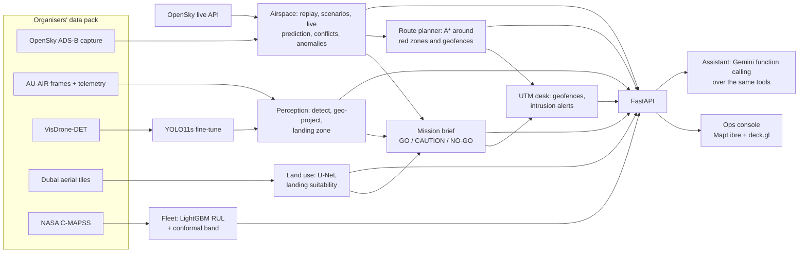
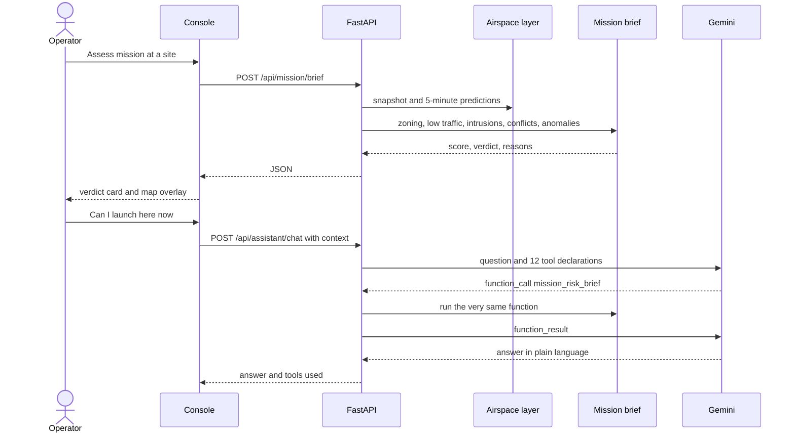

# SkyOps — an AI control tower for the drone era

Code Cortex 3.0 (TAM-VIT), Drone Tech & Aviation track.

India is opening its low-level airspace to drones, but the desk that approves a flight still works from static
maps. SkyOps is that desk, rebuilt around one question an operator actually asks:
**"Is it safe to fly this mission, here, now?"** It fuses live air traffic, the drone's own camera and telemetry,
land-use maps and fleet health, answers GO / CAUTION / NO-GO, and always shows its reasons.

| Layer | Data (all five sets in the organisers' pack) | What SkyOps does with it |
|---|---|---|
| Airspace | OpenSky ADS-B capture over India (214 aircraft, 20 snapshots) + live OpenSky feed | Replay or live map, 5-minute trajectory prediction, loss-of-separation detection, explainable anomaly flags |
| Mission brief + route planner | Airspace layer + airport zoning + registered geofences | GO / CAUTION / NO-GO with reasons; A* corridor around red zones and other operators' geofences |
| Drone perception | AU-AIR frames with synced GPS / altitude / IMU; VisDrone-DET | Fine-tuned YOLO finds people and vehicles, telemetry places them on the map, landing zone is scored |
| Land use | Dubai aerial segmentation tiles | U-Net segments the ground and rates it for an emergency landing |
| Fleet health | NASA C-MAPSS turbofan run-to-failure | Remaining Useful Life per engine with a calibrated 80 % band, grounding list |
| Ops assistant | Gemini free tier, function calling over every layer | "Can I launch at the mission site now?" answered from the same tools, with an offline fallback |

**New here?** Do the [Quick start](#quick-start), then read [A guided walk through the console](#a-guided-walk-through-the-console).
**Presenting?** Open [PITCH.md](PITCH.md). **Moving to another laptop?** Open [HANDOFF.md](HANDOFF.md).

---

## Quick start

Windows, PowerShell, Python 3.11. About 10 minutes, most of it downloads.

```powershell
git clone https://github.com/sirjansingh8888/skyops.git
cd skyops
.\scripts\setup.ps1            # creates .venv and installs everything  (add -Cuda on a laptop with an NVIDIA GPU)
.\.venv\Scripts\python.exe scripts\download_data.py --all     # about 700 MB of datasets
notepad .env                   # paste your free GEMINI_API_KEY (how to get one: HANDOFF.md). Optional.
.\scripts\run.ps1              # then open http://127.0.0.1:8000
```

You should see a dark map of India with aircraft moving, a panel of tabs on the right, and status chips on top.
Press **Tour** for a hands-free 70-second walkthrough of every feature.

- The trained models are already in `models/`, so nothing needs training.
- Without a Gemini key the Assistant tab still answers, in a simpler "offline rules" mode.
- Linux / macOS: `python -m venv .venv && . .venv/bin/activate && pip install -r requirements-torch-cpu.txt -r requirements.txt`,
  then the same `download_data.py` and `python -m uvicorn skyops.api.main:app --port 8000`.
- Check the install any time with `.\.venv\Scripts\python.exe -m pytest -q` (17 tests, about 20 s).

---

## A guided walk through the console

The top bar is always visible: status chips (aircraft, conflicts, anomalies, geofence alerts, assistant), the
**scenario** selector, **Tour**, **LIVE**, and the replay controls (play / pause and a 20-step slider).

### 1. Airspace tab — what is flying, and is anything wrong?

- **You see** every aircraft as an arrow (amber = low, cyan = high), a faint trail behind it and a thin line ahead
  showing where it will be in the next 5 minutes. Purple circles are airport zones (5 km red, 12 km yellow).
- **Try this** Click an aircraft for its card. Click a row under *Separation conflicts* to fly to the pair.
  Switch the scenario selector to `combined`: two simulated jets (violet, labelled DEMO01 / DEMO02) converge and the
  conflict escalates from warning to alert to critical, while a real flight squawks 7700 and descends.
- **Behind it** `skyops/airspace/`: `loader.py` tidies the state vectors, `predict.py` extrapolates each aircraft
  (constant speed, turn rate and vertical rate), `conflicts.py` checks every pair at every horizon against 5 NM / 1000 ft
  (3 NM near airports, with a tolerance band so ordinary 1000 ft separation is not a false alarm), `anomalies.py`
  applies readable rules. One call, `GET /api/airspace/snapshot/{t}`, returns everything the map draws.
- **LIVE** swaps the recording for real-time traffic from the OpenSky Network; everything else keeps working on it.
  Anonymous access is limited to roughly 100 calls a day for this area, so use it for minutes, not hours.

### 2. Mission tab — can I fly here, and how do I get there?

- **Assess mission** Enter or pick a site. The brief combines airport zoning, the 120 m ceiling, manned aircraft
  below 5,000 ft nearby, aircraft *predicted* to enter, conflicts and anomalies around the site, and optionally the
  current drone frame and land-use tile. Presets: "Delhi (near IGI)" is NO-GO, "VIT Vellore" is GO.
  Code: `skyops/mission.py`, `POST /api/mission/brief`.
- **Route planner** The site is the start; pick a destination or a demo route. The planner runs A* on a local grid,
  treats red zones and other operators' geofences as walls, makes yellow zones and low-level traffic expensive,
  smooths the path, and compares it with the straight line. "Delhi: Dwarka → Vasant Kunj" is the showcase: the red
  line crosses the airport, the green corridor goes around it for +32 % distance, 20 minutes, 67 % battery.
  Code: `skyops/route.py`, `POST /api/route/plan`.
- **UTM desk** *Register geofence* stores the flight as a cylinder. The brief decides approved,
  approved-with-caution or rejected. From then on every tick checks manned traffic against it and raises
  `INTRUSION` / `PREDICTED_INTRUSION` alerts (Airspace tab, top card). Code: `skyops/utm.py`.

### 3. Drone tab — what does the drone see?

- **You see** a real drone flight (AU-AIR) with boxes from our detector, the telemetry under it, and a landing-zone
  verdict. On the map: the drone, its camera footprint, and each detected object placed on the ground.
- **Try this** *Play flight*. Tick *use dataset boxes* to compare with the human annotations. Move the *camera tilt*
  slider and watch the footprint change. *Relocate flight to mission site* moves the Danish flight onto your site.
- **Behind it** `skyops/perception/`: `detect.py` (YOLO11s fine-tuned on VisDrone), `auair.py` (telemetry),
  `geoproject.py` (pinhole camera model: altitude + heading + tilt turn a pixel into metres east / north),
  `landing.py` (grid occupancy and clearance). The exact AU-AIR camera geometry is unpublished, hence the sliders.

### 4. Land use tab — where could it land in an emergency?

- Pick a tile and flip between image, overlay, mask and ground truth. Bars show the surface mix; the card rates
  landing suitability (open land 1.0, vegetation 0.6, road 0.35, buildings and water 0).
- Code: `skyops/landuse/` (U-Net with a ResNet-18 encoder; colour rules remain as a fallback if weights are missing).

### 5. Fleet tab — which engines should not fly?

- A table of test engines sorted by predicted Remaining Useful Life, with the true value beside it; click one for
  its degradation curve with the 80 % band and the sensors that are trending.
- Code: `skyops/fleet/` (rolling-window features normalised per operating condition, LightGBM point model,
  quantile offsets, conformal calibration so the 80 % band really covers about 80 %).

### 6. Metrics tab — how do you know it works?

Every model's test, live from `GET /api/metrics`, including the experiment that failed (the learned trajectory model
that did not beat physics). This is the tab to keep open during questions.

### 7. Assistant tab — ask the tower

- Preset questions or free text. The assistant can only answer from tool results; the chips under each answer show
  which tools it called. It knows the current snapshot, mission site, route destination, drone frame and tile.
- Code: `skyops/assistant/`. `tools.py` holds 12 plain Python functions; their signatures and docstrings are turned
  into function declarations automatically. `gemini_agent.py` runs the documented function-calling loop with bounded
  latency; `offline.py` answers with templates when there is no key, no quota or no network.

---

## How it works at run time



The same Python functions serve the console, the API and the assistant, so a number can never differ between them.
Here is one question travelling through the system twice, first as a button, then as a chat message:



---

## How it was built

```mermaid
flowchart TD
  subgraph R["1 Research"]
    R1["Read the event site: 5 tracks, 13 checkpoints,<br/>2 elimination reviews inside 30 hours"]
    R2["Crawl the 4 public Drive folders and open every dataset.<br/>Multi-GB zips were listed remotely with HTTP range requests"]
    R3{"Which idea?"}
    R1 --> R2 --> R3
  end
  R3 -->|"least crowded track, best curated data,<br/>one product can use all 5 datasets"| F1
  subgraph F["2 Foundation"]
    F1["Scaffold: Python package, FastAPI, static console, venv, git"]
    F2["Data fetcher that pulls only the needed files<br/>out of the 4.4 GB archives"]
    F1 --> F2
  end
  F2 --> C1
  subgraph C["3 Core layers, each one usable before any training"]
    C1["Airspace: loader, dead reckoning, conflicts, anomalies"]
    C2["Mission brief: zoning + traffic + predictions"]
    C3["Perception: YOLO, telemetry, pixel-to-ground, landing zone"]
    C4["Land use: colour-rule placeholder + U-Net trainer"]
    C5["Fleet: features, k-NN placeholder + LightGBM trainer"]
    C1 --> C2
    C1 --> C3 --> C4 --> C5
  end
  C2 --> U1
  C5 --> U1
  subgraph U["4 Product"]
    U1["FastAPI endpoints and the ops console"]
    U2["Scenarios, UTM geofences, LIVE feed, Metrics tab"]
    U3["Route planner: A* around red zones and geofences"]
    U1 --> U2 --> U3
  end
  U3 --> M1
  subgraph M["5 Training, with the evidence kept"]
    M1["Fleet RUL on CPU in 22 s"]
    M2["YOLO11s on VisDrone, RTX 3070 Ti, 35 min"]
    M3["U-Net on Dubai tiles, 2 min"]
    M4["GRU against dead reckoning: not better, not deployed"]
    M1 --> M2 --> M3 --> M4
  end
  M4 --> A1
  subgraph A["6 Assistant"]
    A1["Provider-neutral tools, declarations generated from signatures"]
    A2["Gemini free tier: read the current docs, benchmark the models"]
    A3["Bounded latency: timeout, lite fallback, circuit breaker, offline rules"]
    A1 --> A2 --> A3
  end
  A3 --> H1
  subgraph H["7 Hardening and shipping"]
    H1["17 tests, guided Tour, pitch kit, handoff guide"]
    H2["Fresh-clone check on Windows"]
    H3["Public repo with trained weights: clone, setup, run"]
    H1 --> H2 --> H3
  end
```



The order mattered: every layer shipped with a training-free placeholder first, so the whole product was demo-able
before the first model was trained, which is what an elimination review after 7 hours demands.

What went wrong along the way, and what changed because of it:

| Stage | What we found | What we did |
|---|---|---|
| Trajectory evaluation | Median error looked like 1.7 km at 60 s | The test compared against snapshots up to 12 s off; interpolating the true track to the exact time gives 125 m |
| Conflict detection | Aircraft correctly 1000 ft apart showed as "critical" | Barometric altitude is noisy and quantised; added a 150 ft tolerance and a separate "marginal" class |
| Mission brief | HTTP 500 from the console only | A predicted intruder can be missing from the current snapshot; callsigns now come from the whole track |
| Fleet RUL | The p90 quantile model stopped at iteration 1 | The 125-cycle label cap made every gradient identical; quantile models now learn offsets around the median, then conformal calibration lifted coverage from 65 % to about 80 % |
| YOLO fine-tune | Training slowed from 4 it/s to 3 s/it | Dense VisDrone images overflowed 8 GB of VRAM at batch 8; rerun at batch 4 ran at 10 it/s |
| Land-use placeholder | 4 % pixel accuracy | Desert sand is as bright as rooftops; per-class statistics showed texture separates them (now 63 %, U-Net 84 %) |
| Learned trajectory model | GRU only 1-3 % better, no gain on turns | Kept behind a flag; dead reckoning stays in production and the Metrics tab says why |
| Assistant | One answer took 130 s | The newest free-tier models were overloaded and the SDK retried silently; switched default model, disabled hidden retries, added timeout, fallback, circuit breaker and offline rules |
| Shipping | A fresh clone on Windows crashed on the Fleet tab | Git's line-ending conversion corrupted the LightGBM text models; `.gitattributes` keeps them byte-exact and the loader tolerates CRLF |

---

## Models and measured results

All weights are committed in `models/` (about 51 MB). The Metrics tab shows these numbers live.

| Model | Training | Result |
|---|---|---|
| Trajectory: curvilinear dead reckoning | none | median error 125 m at 60 s, 272 m at 120 s, against the aircraft's real later positions (2,234 comparisons) |
| Fleet RUL: LightGBM + conformalised quantile offsets | CPU, 22 s | test RMSE 16.8 / 15.7 / 17.5 / 17.8 cycles on FD001-FD004 (k-NN baseline 22.2); the 80 % band covers 76-81 % of held-out engines |
| Drone detector: YOLO11s fine-tuned on 2,500 VisDrone images | RTX 3070 Ti, 30 epochs at 960 px, about 35 min | VisDrone val mAP50 0.47, mAP50-95 0.28. On the AU-AIR demo frames, which it never trained on, recall rises from 31 % (COCO placeholder) to 77 % at 60 % precision |
| Land use: U-Net ResNet-18 on 60 Dubai tiles | RTX 3070 Ti, 60 epochs, about 2 min | mIoU 0.65 and 84 % pixel accuracy on 12 held-out tiles (colour rules: 63 %) |
| Trajectory GRU residual (experiment) | CPU, 20 s on 15.6k samples | only 1-3 % lower mean error on held-out aircraft and none on turning traffic: not deployed (`SKYOPS_USE_GRU=true` to try it) |

Every model has a training-free placeholder (COCO YOLO, colour rules, k-NN, dead reckoning), so the app still runs
if a weight file is missing; `GET /api/health` shows what is loaded.

### Retraining (optional)

```powershell
# Fleet RUL, CPU, about 25 s
.\.venv\Scripts\python.exe -m skyops.fleet.train --subsets FD001 FD002 FD003 FD004

# VisDrone YOLO, GPU, about 35 min on an 8 GB card (batch 4: dense images overflow 8 GB at batch 8)
.\.venv\Scripts\python.exe scripts\download_data.py --only visdrone --visdrone-train 2500
.\.venv\Scripts\python.exe -m skyops.perception.train_visdrone --model yolo11s.pt --epochs 30 --imgsz 960 --batch 4 --device 0
.\.venv\Scripts\python.exe scripts\eval_auair.py --frames 120     # transfer check on the demo footage

# Land-use U-Net, GPU, about 2 min
.\.venv\Scripts\python.exe -m skyops.landuse.train --epochs 60 --device cuda

# Trajectory GRU experiment, CPU; record more traffic first
.\.venv\Scripts\python.exe scripts\record_opensky.py --minutes 30 --interval 20
.\.venv\Scripts\python.exe -m skyops.airspace.train_gru --csv data\raw\opensky\*.csv
```

The RTX 50-series (Blackwell) needs PyTorch 2.7 or newer built for CUDA 12.8; `scripts\setup.ps1 -Cuda` installs it.
Inference picks the GPU automatically when PyTorch can see one.

---

## Data

`scripts/download_data.py` fetches from the organisers' public Drive folder. Small sets are downloaded whole. The two
multi-GB archives are never downloaded in full: the script reads the zip's central directory over HTTP and pulls only
the files it needs with range requests.

| Dataset | Fetched by default | Size on disk |
|---|---|---|
| OpenSky ADS-B capture | whole | 0.5 MB |
| NASA C-MAPSS | whole | 43 MB |
| Dubai aerial segmentation | whole | 200 MB |
| VisDrone2019-DET (1.96 GB archive) | 548 val + 800 train images (`--visdrone-train N` for more) | 245 MB |
| AU-AIR (2.46 GB archive) | annotations + 600 frames (`--auair-frames N`) | 60 MB |

Datasets stay out of git. Licences: VisDrone and AU-AIR are research / non-commercial, Dubai tiles are CC0,
C-MAPSS is a U.S. Government work, OpenSky data is for non-commercial research.

---

## Configuration (`.env`)

| Setting | Default | Meaning |
|---|---|---|
| `GEMINI_API_KEY` | empty | free key from https://aistudio.google.com/apikey; without it the assistant uses offline rules |
| `SKYOPS_GEMINI_MODEL` | `gemini-3.6-flash` | main assistant model (fastest reliable free-tier model in our tests, about 10 s per question) |
| `SKYOPS_GEMINI_FALLBACK_MODEL` | `gemini-3.5-flash-lite` | finishes a question after a timeout, 429 or 5xx |
| `SKYOPS_GEMINI_TIMEOUT_S` | `25` | hard cap per API call |
| `SKYOPS_ASSISTANT_PROVIDER` | `gemini` | `claude` also works (`pip install anthropic`, `ANTHROPIC_API_KEY`) |
| `SKYOPS_DEVICE` | `auto` | `auto`, `cpu` or `cuda` for inference |
| `SKYOPS_OPENSKY_CSV` | organisers' capture | replay your own recording from `scripts/record_opensky.py` |
| `SKYOPS_OPENSKY_CLIENT_ID` / `_SECRET` | empty | optional OpenSky API client for ten times the live-feed quota |
| `SKYOPS_USE_GRU` | `false` | opt in to the GRU trajectory experiment |
| `SKYOPS_HOST`, `SKYOPS_PORT` | `127.0.0.1`, `8000` | where the server listens |

`.env` is git-ignored. Never commit a key.

---

## Project layout

```
skyops/
  README.md, HANDOFF.md, PITCH.md      this guide, moving between laptops + Gemini key, presenting
  scripts/
    setup.ps1, run.ps1, make_bundle.ps1
    download_data.py                   Drive fetcher with remote-zip partial extraction
    record_opensky.py                  record live traffic into the capture's CSV format
    eval_auair.py                      detector transfer test on the demo footage
  skyops/
    config.py                          paths, constants, settings (SKYOPS_* and .env)
    airspace/                          loader (active-airspace registry), predict, conflicts, anomalies,
                                       airports, scenarios, live (OpenSky feed), train_gru
    mission.py                         the go / no-go risk brief
    route.py                           A* route planner around red zones and geofences
    utm.py                             mission registry, geofences, intrusion alerts
    perception/                        detect (YOLO), auair (telemetry), geoproject, landing, analyze, train_visdrone
    landuse/                           data, infer (U-Net or colour rules), analyze, train
    fleet/                             features, predict (LightGBM or k-NN), train
    assistant/                         tools, gemini_agent (default), agent (Claude, optional), offline, prompts
    api/main.py                        FastAPI app + static console
  web/                                 index.html, app.js, styles.css, vendor/ (MapLibre, deck.gl)
  models/                              trained weights and their metric files (committed)
  tests/test_smoke.py                  17 tests
  data/raw/                            datasets (git-ignored)
```

## API (selected; full docs at `/docs`)

| Endpoint | Purpose |
|---|---|
| `GET /api/airspace/snapshot/{t}` | states, predicted paths, conflicts, anomalies, geofence alerts (`-1` = latest) |
| `GET /api/scenarios`, `POST /api/scenario` | list and switch demo scenarios |
| `POST /api/live/start`, `/stop`, `GET /api/live/status` | live OpenSky feed |
| `POST /api/mission/brief` | go / no-go brief for a site |
| `POST /api/route/plan` | corridor around red zones and geofences |
| `GET`, `POST`, `DELETE /api/utm/missions` | geofence registry |
| `GET /api/drone/frame/{name}` (+ `/image`), `POST /api/drone/detect` | detections, geo-projection, landing zone; upload your own image |
| `GET /api/landuse/tile/{name}` (+ `/image?mode=`), `POST /api/landuse/segment` | segmentation and landing suitability |
| `GET /api/fleet/{subset}`, `/api/fleet/{subset}/{unit}` | RUL table and engine history |
| `GET /api/metrics`, `GET /api/health` | model card; data, models and device status |
| `POST /api/assistant/chat`, `GET /api/assistant/status` | assistant |

---

## Troubleshooting

| Symptom | Cause and fix |
|---|---|
| Map is black but aircraft show | No internet for the basemap tiles; every layer still works |
| "No drone frames / tiles on disk" | Run `scripts\download_data.py --only auair dubai` |
| Drive download says it got an HTML page | Drive throttled the file; retry in a few minutes |
| Assistant says "offline rules" | No `GEMINI_API_KEY` in `.env`, or the server was not restarted after adding it |
| Assistant is slow or mentions a timeout | Free-tier models get busy; try another Flash model in `SKYOPS_GEMINI_MODEL`. Answers still arrive through the fallback |
| LIVE fails with a rate-limit message | The anonymous OpenSky quota (about 100 calls a day here) is used up; it resets daily, or add an API client in `.env` |
| Fleet tab takes 10 s the first time | It builds rolling features for the whole subset once, then caches |
| `torch.cuda.is_available()` is False on an RTX 50 | CPU wheels were installed; run `pip install --force-reinstall -r requirements-torch-cu128.txt` |
| CUDA out of memory while training YOLO | Lower `--batch` (4 works on 8 GB) or `--imgsz` |
| Port 8000 is busy | `.\scripts\run.ps1 -Port 8010` |
| LightGBM "Model format error" | Model files were converted to CRLF by an old checkout; `git pull`, then `git checkout -- models/` |

## Sharing a running demo

The quickest way to give judges a URL is a tunnel to the laptop that has the GPU and the data:

```powershell
winget install --id Cloudflare.cloudflared      # once
cloudflared tunnel --url http://localhost:8000  # prints a public https URL while it runs
```

Anyone with that URL can drive the console and spend your assistant quota, so stop the tunnel after the demo.
(These two commands are the documented Cloudflare quick-tunnel usage; they have not been run on the development laptop.)
A `Dockerfile` for CPU inference is included as a starting point; it has been written but not built yet, because
Docker is not installed on the development laptop.
